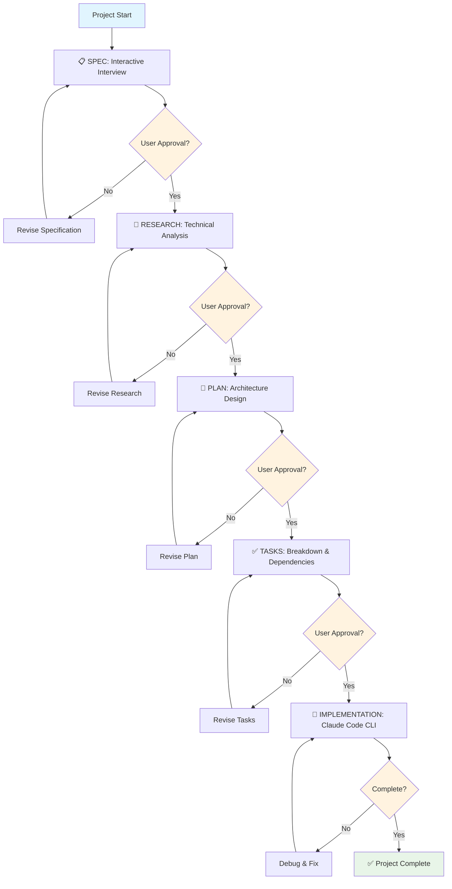

# Orchestrator - Specification-Driven Development Framework

A comprehensive specification-driven development orchestrator **orch Claude Code subagent** designed to manage and automate development workflows through systematic, approval-gated phases that ensure quality and proper progression.

## 🎯 Executive Summary

**Orchestrator** transforms chaotic "agile" (single-prompt-shot's vibe-coding and non-interactive's spec-kit approaches) by conducting user interviews and research, in an interactive friendly way ensuring **systematic, specification-driven workflows** that produce high-quality, well-documented software. By enforcing a structured **spec → research → plan → tasks** methodology with user approval gates, Orchestrator ensures every development phase is properly validated before implementation.

### The Methodology

Orchestrator implements a **four-phase workflow** with mandatory approval gates:

1. **📋 Specification Phase**: Interactive interviews generate comprehensive requirements and constraints
2. **🔬 Research Phase**: Systematic technical analysis with validated sources and best practices  
3. **📐 Planning Phase**: Architectural design and implementation strategies
4. **✅ Tasks Phase**: Executable task breakdown with clear dependencies and numbering

Each phase requires **explicit user approval** before progression, ensuring alignment and quality throughout the development process.

### Workflow Decision Diagram

```ascii
┌─────────────┐    ┌─────────────┐    ┌─────────────┐    ┌─────────────┐
│    SPEC     │───▶│  RESEARCH   │───▶│    PLAN     │───▶│    TASKS    │
│ Interactive │    │ Technical   │    │Architecture │    │Breakdown &  │
│ Interview   │    │ Analysis    │    │ Design      │    │Dependencies │
└─────────────┘    └─────────────┘    └─────────────┘    └─────────────┘
        │                   │                   │                   │
        ▼                   ▼                   ▼                   ▼
┌─────────────┐    ┌─────────────┐    ┌─────────────┐    ┌─────────────┐
│USER APPROVAL│    │USER APPROVAL│    │USER APPROVAL│    │IMPLEMENTATION│
│Required     │    │Required     │    │Required     │    │via Claude   │
│to proceed   │    │to proceed   │    │to proceed   │    │Code CLI     │
└─────────────┘    └─────────────┘    └─────────────┘    └─────────────┘
        │                   │                   │                   │
        ▼                   ▼                   ▼                   ▼
   ┌─────────┐         ┌─────────┐         ┌─────────┐         ┌─────────┐
   │Approved?│         │Approved?│         │Approved?│         │Complete?│
   │Yes→Next │         │Yes→Next │         │Yes→Next │         │Yes→Done │
   │No→Revise│         │No→Revise│         │No→Revise│         │No→Debug │
   └─────────┘         └─────────┘         └─────────┘         └─────────┘
```



## 🚀 Installation

### System Requirements

- **Claude Code CLI** (required for orch subagent)
- **Node.js** (v16+ recommended)

### Quick Install

```bash
# Clone or download orchestrator
git clone <repository-url>
cd orchestrator

# Install in any project
./install-orchestrator.sh [target-project-path]

# Or install in current directory
./install-orchestrator.sh
```

### What Gets Installed

```
target-project/
├── .orchestrator/          # Core orchestrator tool (hidden)
│   ├── cli.js             # Main CLI interface
│   ├── commands/          # Command implementations
│   ├── core/              # Core functionality
│   └── package.json       # Dependencies
├── .claude/               # Claude Code integration
│   └── agents/
│       └── orch.md        # Orch subagent configuration
└── orch                   # Convenience wrapper script
```

### Verification

```bash
# Test installation
./orch --help

# Test orch subagent (in Claude Code)
/orch status
```

## 📖 User Guide

### Available Commands

#### Core Workflow Commands

```bash
# 1. Generate Specification
./orch spec <phase>
/orch spec st01-authentication

# 2. Conduct Research  
./orch research <phase>
/orch research st01-authentication

# 3. Create Implementation Plan
./orch plan <phase>
/orch plan st01-authentication

# 4. Generate Task Breakdown
./orch tasks <phase>
/orch tasks st01-authentication
```

#### Management Commands

```bash
# Check phase status
./orch status <phase>
/orch status st01-authentication

# Process approval
./orch approve <phase> --type <spec|research|plan|tasks> --approved
./orch approve st01-authentication --type spec --approved

# Show project progress
./orch progress
./orch progress st01-authentication
```

### Usage Methods

#### 1. Claude Code CLI (Recommended)
```bash
/orch spec st01-authentication
```

#### 2. Convenience Wrapper
```bash
./orch spec st01-authentication
```

#### 3. Direct CLI (Terminal)
```bash
cd .orchestrator
node cli.js spec st01-authentication
```

### Phase Naming Convention

Use the format: `st##-descriptive-name`

**Examples:**
- `st01-foundation` - Core system foundation
- `st02-authentication` - User authentication system
- `st03-user-management` - User management features
- `st07-audio-engine` - Audio processing engine

### Interactive Workflow

Each command follows a **three-stage process**:

1. **Interview**: Interactive questions to gather requirements
2. **Generation**: Create comprehensive documentation
3. **Approval**: User review and explicit approval before progression

#### Example: Specification Generation

```bash
/orch spec st01-authentication

# Orchestrator will ask:
# - What are the main objectives?
# - What are the key requirements?
# - What constraints exist?
# - What dependencies are needed?
# 
# Then generates comprehensive spec document
# Requires user approval before research phase
```

### Command Options

#### Specification Command
```bash
./orch spec <phase> [options]
--objectives "Real-time processing,Low latency"
--requirements "OAuth2 support,JWT tokens"
--dependencies "passport,jsonwebtoken"
```

#### Research Command
```bash
./orch research <phase> [options]
--sources "OAuth2 docs,JWT best practices"
--foundation "Security analysis"
```

#### Planning Command
```bash
./orch plan <phase> [options]
--architecture "Microservices architecture"
--components "AuthService,TokenManager,UserValidator"
```

#### Tasks Command
```bash
./orch tasks <phase> [options]
--tasks "Setup,Development,Testing,Documentation"
--hours "4,16,8,4"
```

#### Approval Command
```bash
./orch approve <phase> [options]
--type <spec|research|plan|tasks>
--approved | --rejected
--comments "Looks good, approved for next phase"
```

### File Structure Generated

Each phase creates a structured directory:

```
dev/
└── st01-authentication/
    ├── spec.md              # Specification document
    ├── research.md          # Research analysis
    ├── plan.md              # Implementation plan
    ├── tasks.md             # Task breakdown
    └── phase-state.json     # Workflow state tracking
```

## 🔧 Integration with Claude Code

### Orch Subagent

The `orch` subagent is automatically installed and configured to:

- Execute all orchestrator commands via Bash tool
- Maintain workflow state and validation
- Enforce approval gates and sequential progression
- Generate comprehensive documentation

### Subagent Usage

```bash
# In Claude Code CLI, use /orch commands:
/orch spec st01-authentication
/orch research st01-authentication  
/orch plan st01-authentication
/orch tasks st01-authentication
/orch status st01-authentication
```

### Implementation Handoff

After task approval, provide tasks to Claude Code:

```
The tasks are approved. Please implement:
- T001: Setup authentication middleware
- T002: Implement JWT token generation
- T003: Create user validation service
- T004: Add OAuth2 integration
- T005: Write comprehensive tests

Refer to the complete specification at dev/st01-authentication/
```

## 🛠 Troubleshooting

### Common Problems & Solutions

#### 1. "Specification must be approved before starting research"

**Problem**: Trying to run research before spec approval
**Solution**: 
```bash
./orch approve st01-authentication --type spec --approved
# Then proceed with research
./orch research st01-authentication
```

#### 2. "Phase not found" errors

**Problem**: Phase doesn't exist or wrong naming
**Solution**:
```bash
# Check existing phases
./orch status

# Use correct naming convention
./orch spec st01-authentication  # Correct
./orch spec authentication       # Incorrect
```

#### 3. Missing dependencies

**Problem**: npm install fails
**Solution**:
```bash
cd .orchestrator
npm install
# Or reinstall orchestrator
./install-orchestrator.sh
```

#### 4. Orch subagent not working in Claude Code

**Problem**: `/orch` commands not recognized
**Solution**:
```bash
# Verify agent installation
ls -la .claude/agents/orch.md

# Reinstall if missing
./install-orchestrator.sh

# Ask Claude Code to read this README
# "Please read README.md and understand the orch subagent setup"
```

#### 5. Permission denied errors

**Problem**: Script execution fails
**Solution**:
```bash
chmod +x install-orchestrator.sh
chmod +x orch
```

#### 6. Interactive prompts not working

**Problem**: CLI commands hang on input
**Solution**:
```bash
# Use Claude Code /orch commands instead
# The subagent handles interactivity better
/orch spec st01-authentication
```

### Getting Help

#### For Installation Issues:
1. Verify Node.js installation: `node --version`
2. Check file permissions: `ls -la install-orchestrator.sh`
3. Review installation output for errors

#### For Workflow Issues:
1. Check phase status: `./orch status <phase>`
2. Review approval requirements
3. Ensure sequential progression (spec → research → plan → tasks)

#### For Claude Code Integration:
1. Ask Claude Code to read this README
2. Verify orch.md exists in `.claude/agents/`
3. Test with simple command: `/orch status`

### Pro Tips

1. **Always use Claude Code `/orch` commands** for best experience
2. **Read generated documents** before approving each phase  
3. **Use descriptive phase names** following st##-name convention
4. **Keep specifications focused** - one major feature per phase
5. **Review dependencies** between phases before starting

## 🔄 Update Installation

To update an existing orchestrator installation:

```bash
# Reinstall (preserves state files)
./install-orchestrator.sh

# Force clean install
rm -rf .orchestrator .claude/agents/orch.md orch
./install-orchestrator.sh
```

## 📚 Additional Resources

- **Templates**: `.orchestrator/templates/`

---

**🎯 Ready to transform your development workflow?**

Start with: `/orch spec st01-foundation` and let Orchestrator guide you through systematic, specification-driven development!
