# Orchestrator - Specification-Driven Development Framework

A comprehensive specification-driven development orchestrator **orch Claude Code subagent** designed to manage and automate development workflows through systematic, approval-gated phases that ensure quality and proper progression.

## 🎯 Executive Summary

**Orchestrator** transforms chaotic "agile" (single-prompt-shot's vibe-coding and non-interactive's spec-kit approaches) by conducting user interviews and research, in an interactive friendly way ensuring **systematic, specification-driven workflows** that produce high-quality, well-documented software. By enforcing a structured **spec → research → plan → prd → tasks** methodology with user approval gates, Orchestrator ensures every development phase is properly validated before implementation.

### The Methodology

Orchestrator implements a **five-phase workflow** with mandatory approval gates:

1. **📋 Specification Phase**: Interactive interviews generate comprehensive requirements and constraints
2. **🔬 Research Phase**: Systematic technical analysis with validated sources and best practices  
3. **📐 Planning Phase**: Architectural design and implementation strategies
4. **📊 PRD Phase**: MVP definition with semantic analysis and feature prioritization
5. **✅ Tasks Phase**: Executable task breakdown with clear dependencies and numbering

Each phase requires **explicit user approval** before progression, ensuring alignment and quality throughout the development process.

### Workflow Decision Diagram

```mermaid
graph TD
    subgraph Initial Setup
        A[Start] --> A1{Config Exists?};
        A1 -->|No| A2[🚀 First-Run Setup: Configure Preferences];
        A1 -->|Yes| B[Project Start];
        A2 --> B;
    end

    B --> C[📋 SPEC: Interactive Interview];
    C --> D{User Approval?};
    D -->|No| C1[Revise Specification];
    C1 --> C;
    D -->|Yes| E[🔬 RESEARCH: Technical Analysis];
    E --> F{User Approval?};
    F -->|No| E1[Revise Research];
    E1 --> E;
    F -->|Yes| G[📐 PLAN: Architecture Design];
    G --> H{User Approval?};
    H -->|No| G1[Revise Plan];
    G1 --> G;
    H -->|Yes| I[📊 PRD: MVP & Semantic Analysis];
    I --> J{User Approval?};
    J -->|No| I1[Revise PRD];
    I1 --> I;
    J -->|Yes| K[✅ TASKS: Breakdown & Dependencies];
    K --> L{User Approval?};
    L -->|No| K1[Revise Tasks];
    K1 --> K;
    L -->|Yes| M[🚀 IMPLEMENTATION: Claude Code CLI];
    M --> N{Complete?};
    N -->|No| O[Debug & Fix];
    O --> M;
    N -->|Yes| P[✅ Project Complete];

    style A2 fill:#f3e5f5
    style B fill:#e1f5fe
    style P fill:#e8f5e8
    style D fill:#fff3e0
    style F fill:#fff3e0
    style H fill:#fff3e0
    style J fill:#fff3e0
    style L fill:#fff3e0
    style N fill:#fff3e0
```



## 🚀 Installation

### System Requirements

- **Claude Code CLI** (required for orch subagent)
- **Node.js** (v16+ recommended)

### Quick Install

```bash
# Clone or download orchestrator
git clone https://github.com/Nyrk0/orchestrator
cd orchestrator

# Install in any project
./install-orchestrator.sh [target-project-path]

# Or install in current directory
./install-orchestrator.sh
```

### What Gets Installed

```
target-project/
├── .orchestrator/          # Core orchestrator tool (hidden)
│   ├── cli.js             # Main CLI interface
│   ├── commands/          # Command implementations
│   ├── core/              # Core functionality
│   └── package.json       # Dependencies
├── .claude/               # Claude Code integration
│   └── agents/
│       └── orch.md        # Orch subagent configuration
└── orch                   # Convenience wrapper script
```

### Verification

```bash
# Test installation
./orch --help

# Test orch subagent (in Claude Code)
/orch status
```

## 📖 User Guide

### Available Commands

#### Core Workflow Commands

```bash
# 1. Generate Specification
./orch spec <phase>
/orch spec st01-authentication

# 2. Conduct Research  
./orch research <phase>
/orch research st01-authentication

# 3. Create Implementation Plan
./orch plan <phase>
/orch plan st01-authentication

# 4. Generate PRD with Semantic Analysis
./orch prd <phase>
/orch prd st01-authentication

# 5. Generate Task Breakdown
./orch tasks <phase>
/orch tasks st01-authentication
```

#### Management Commands

```bash
# Generate project dashboard and get next-step advice
./orch dashboard

# Check phase status
./orch status <phase>
/orch status st01-authentication

# Process approval
./orch approve <phase> --type <spec|research|plan|prd|tasks> --approved
./orch approve st01-authentication --type spec --approved

# Add to project memory
./orch remember "All APIs must use OAuth2 authentication"
/orch remember "Performance requirement: < 100ms response time"

# Show project progress
./orch progress
./orch progress st01-authentication
```

### Usage Methods

#### 1. Claude Code CLI (Recommended)
```bash
/orch spec st01-authentication
```

#### 2. Convenience Wrapper
```bash
./orch spec st01-authentication
```

#### 3. Direct CLI (Terminal)
```bash
cd .orchestrator
node cli.js spec st01-authentication
```

### Phase Naming Convention

Use the format: `st##-descriptive-name`

**Examples:**
- `st01-foundation` - Core system foundation
- `st02-authentication` - User authentication system
- `st03-user-management` - User management features
- `st07-audio-engine` - Audio processing engine

### Interactive Workflow

Each command follows a **three-stage process**:

1. **Interview**: Interactive questions to gather requirements
2. **Generation**: Create comprehensive documentation
3. **Approval**: User review and explicit approval before progression

#### Example: Specification Generation

```bash
/orch spec st01-authentication

# Orchestrator will ask:
# - What are the main objectives?
# - What are the key requirements?
# - What constraints exist?
# - What dependencies are needed?
# 
# Then generates comprehensive spec document
# Requires user approval before research phase
```

### Command Options

#### Specification Command
```bash
./orch spec <phase> [options]
--objectives "Real-time processing,Low latency"
--requirements "OAuth2 support,JWT tokens"
--dependencies "passport,jsonwebtoken"
```

#### Research Command
```bash
./orch research <phase> [options]
--sources "OAuth2 docs,JWT best practices"
--foundation "Security analysis"
```

#### Planning Command
```bash
./orch plan <phase> [options]
--architecture "Microservices architecture"
--components "AuthService,TokenManager,UserValidator"
```

#### PRD Command (NEW)
```bash
./orch prd <phase> [options]
--mvp-goal "Secure authentication with JWT"
--features "Login,Logout,TokenValidation,PasswordReset"
--success-metrics "Login success rate > 99%"
```

#### Remember Command (NEW)
```bash
./orch remember "<directive>"
./orch remember "All APIs must use OAuth2 authentication"
./orch remember "Performance target: < 100ms response time"
./orch remember "Database: PostgreSQL with connection pooling"
```

#### Tasks Command
```bash
./orch tasks <phase> [options]
--tasks "Setup,Development,Testing,Documentation"
--hours "4,16,8,4"
```

#### Approval Command
```bash
./orch approve <phase> [options]
--type <spec|research|plan|prd|tasks>  # Updated: includes PRD
--approved | --rejected
--comments "Looks good, approved for next phase"
```

### File Structure Generated

Each phase creates a structured directory:

```
dev/
└── st01-authentication/
    ├── spec.md              # Specification document
    ├── research.md          # Research analysis
    ├── plan.md              # Implementation plan
    ├── prd.md               # Product Requirements (MVP focus)
    ├── tasks.md             # Task breakdown
    └── phase-state.json     # Workflow state tracking
┌────────────────────────────────────────────────┐
│ ENHANCED: Context Memory & Smart Features     │
├────────────────────────────────────────────────┤
orch-log.md                   # Project memory system
.orchestrator/
└── orch-config.json         # User preferences & settings
└────────────────────────────────────────────────┘
```

## 🤖 Enhanced Features

### 📊 PRD Phase with Semantic Analysis

The **PRD (Product Requirements Document)** phase uses advanced semantic analysis to:

#### 📈 **Smart Feature Prioritization**
- **Complexity Analysis**: Automatically evaluates feature complexity based on:
  - Technical keywords ("authentication", "real-time", "distributed")
  - Implementation scope and dependencies
  - Integration requirements

- **Impact Assessment**: Analyzes business value through:
  - User experience improvements
  - Performance implications  
  - Security considerations
  - Scalability requirements

#### 🎯 **MVP Intelligence**
```bash
/orch prd st01-authentication

# Automatically generates:
# • MVP Goal: "Secure user authentication with JWT tokens"
# • Feature Matrix: Priority vs Complexity analysis
# • Timeline Estimates: Based on complexity scoring
# • Success Metrics: Measurable outcomes
# • Out-of-Scope: Features to defer
```

#### 📆 **Priority Matrix Output**
```
┌─────────────────┬─────────────────┐
│ CRITICAL (P0)   │ HIGH IMPACT (P1) │
├─────────────────┼─────────────────┤
│ Login/Logout    │ Password Reset   │
│ JWT Validation  │ Profile Update   │
│ Route Protection│ Admin Dashboard  │
└─────────────────┴─────────────────┘
```

### 📝 Context Memory System

#### **Intelligent Project Memory (orch-log.md)**
Orchestrator maintains persistent project context with smart token management:

#### 🎯 **Configurable Memory Levels**
```bash
# During first session, choose memory level:
1. Critical Only (1-2K tokens)     # Errors & approvals only
2. Errors & Warnings (3-5K tokens) # + Workflow violations  
3. Standard Development (8-12K)     # + User decisions & progress
4. Maximum Context (20K tokens)     # + Full chat history
0. No logs (disabled)              # No persistent memory
```

#### 🧐 **Smart Log Management**
- **Automatic Filtering**: Context-aware log entry filtering
- **Token Rotation**: Intelligent rotation when approaching limits
- **Priority Retention**: Critical information always preserved
- **Chat Integration**: Meaningful conversations logged selectively

#### 📝 **Manual Memory with Remember**
```bash
# Add critical project directives
/orch remember "All APIs must use OAuth2 authentication"
/orch remember "Performance target: < 100ms response time"
/orch remember "Database: PostgreSQL with connection pooling"

# These persist across all sessions and phases
```

#### 🔄 **Context Persistence**
Every session automatically loads relevant context:
- Previous phase decisions and approvals
- User preferences and constraints
- Project-specific requirements
- Workflow state and progress

### 🚀 First Session Intelligence

Orchestrator provides intelligent onboarding:

### 📊 Visual Dashboard & Proactive Advisor

The `/orch dashboard` command provides a high-level visual overview of all project phases and their real-time status. After displaying the dashboard, the Proactive Advisor automatically suggests the most logical next steps for the project, turning `orch` into an active guide.

```bash
# Automatic configuration on first use:
👋 I'm Orch - your specification-driven development orchestrator.

I transform chaos into systematic workflows:
• Interactive specification gathering with smart suggestions
• Sequential phases: spec → research → plan → prd → tasks  
• Approval gates ensuring quality progression
• Project memory via orch-log.md for context persistence

Configure preferences:

FEEDBACK STYLE:
1. user-friendly (detailed explanations) [DEFAULT]
2. professional (concise, technical)
3. sudo-style (minimal, expert-level)

CONTEXT MEMORY LEVEL:
1. Critical Only (1-2K tokens)
2. Errors & Warnings (3-5K tokens)  
3. Standard Development (8-12K tokens) [RECOMMENDED]
4. Maximum (20K tokens with chat logs)
0. No logs (disabled)
```

## 🔧 Integration with Claude Code

### Orch Subagent

The `orch` subagent is automatically installed and configured to:

- Execute all orchestrator commands via Bash tool
- Maintain workflow state and validation
- Enforce approval gates and sequential progression
- Generate comprehensive documentation

### Subagent Usage

```bash
# In Claude Code CLI, use /orch commands:
/orch spec st01-authentication
/orch research st01-authentication  
/orch plan st01-authentication
/orch prd st01-authentication        # NEW: MVP & semantic analysis
/orch tasks st01-authentication
/orch remember "Critical constraint" # NEW: Add to project memory
/orch status st01-authentication
```

### Implementation Handoff

After task approval, provide tasks to Claude Code:

```
Tasks approved. Implement according to:

**Phase**: st01-authentication
**Specification**: dev/st01-authentication/spec.md
**Research**: dev/st01-authentication/research.md
**Plan**: dev/st01-authentication/plan.md
**PRD (MVP)**: dev/st01-authentication/prd.md
**Tasks**: dev/st01-authentication/tasks.md

**Task Breakdown**:
- T001: Setup authentication middleware [P0 - Critical]
- T002: Implement JWT token generation [P0 - Critical]
- T003: Create user validation service [P0 - Critical]
- T004: Add OAuth2 integration [P1 - High Impact]
- T005: Write comprehensive tests [P1 - High Impact]

Refer to complete documentation for context and requirements.
See orch-log.md for project memory and constraints.
```

## 🛠 Troubleshooting

### Common Problems & Solutions

#### 1. "Plan must be approved before starting PRD"

**Problem**: Trying to run PRD before plan approval
**Solution**: 
```bash
./orch approve st01-authentication --type plan --approved
# Then proceed with PRD
./orch prd st01-authentication
```

#### 2. "Specification must be approved before starting research"

**Problem**: Trying to run research before spec approval
**Solution**: 
```bash
./orch approve st01-authentication --type spec --approved
# Then proceed with research
./orch research st01-authentication
```

#### 3. "Phase not found" errors

**Problem**: Phase doesn't exist or wrong naming
**Solution**:
```bash
# Check existing phases
./orch status

# Use correct naming convention
./orch spec st01-authentication  # Correct
./orch spec authentication       # Incorrect
```

#### 4. Missing dependencies

**Problem**: npm install fails
**Solution**:
```bash
cd .orchestrator
npm install
# Or reinstall orchestrator
./install-orchestrator.sh
```

#### 5. Orch subagent not working in Claude Code

**Problem**: `/orch` commands not recognized
**Solution**:
```bash
# Verify agent installation
ls -la .claude/agents/orch.md

# Reinstall if missing
./install-orchestrator.sh

# Ask Claude Code to read this README
# "Please read README.md and understand the orch subagent setup"
```

#### 6. Permission denied errors

**Problem**: Script execution fails
**Solution**:
```bash
chmod +x install-orchestrator.sh
chmod +x orch
```

#### 7. Interactive prompts not working

**Problem**: CLI commands hang on input
**Solution**:
```bash
# Use Claude Code /orch commands instead
# The subagent handles interactivity better
/orch spec st01-authentication
```

### Getting Help

#### For Installation Issues:
1. Verify Node.js installation: `node --version`
2. Check file permissions: `ls -la install-orchestrator.sh`
3. Review installation output for errors

#### For Workflow Issues:
1. Check phase status: `./orch status <phase>`
2. Review approval requirements
3. Ensure sequential progression (spec → research → plan → **prd** → tasks)
4. Check project memory: Review `orch-log.md` for context
5. Verify remember directives: Use `/orch remember` for constraints

#### For Claude Code Integration:
1. Ask Claude Code to read this README
2. Verify orch.md exists in `.claude/agents/`
3. Test with simple command: `/orch status`

### Pro Tips

1. **Always use Claude Code `/orch` commands** for best experience
2. **Read generated documents** before approving each phase, especially **PRD for MVP focus**
3. **Use descriptive phase names** following st##-name convention
4. **Keep specifications focused** - one major feature per phase
5. **Leverage context memory** - use `/orch remember` for project constraints
6. **Review PRD priorities** - semantic analysis provides intelligent feature prioritization
7. **Configure memory level** during first session based on project complexity
8. **Review dependencies** between phases before starting

## 🔄 Update Installation

To update an existing orchestrator installation:

```bash
# Reinstall (preserves state files)
./install-orchestrator.sh

# Force clean install
rm -rf .orchestrator .claude/agents/orch.md orch
./install-orchestrator.sh
```

## 📚 Additional Resources

- **Templates**: `.orchestrator/templates/`

---

**🎯 Ready to transform your development workflow?**

Start with: `/orch spec st01-foundation` and let Orchestrator guide you through systematic, specification-driven development!